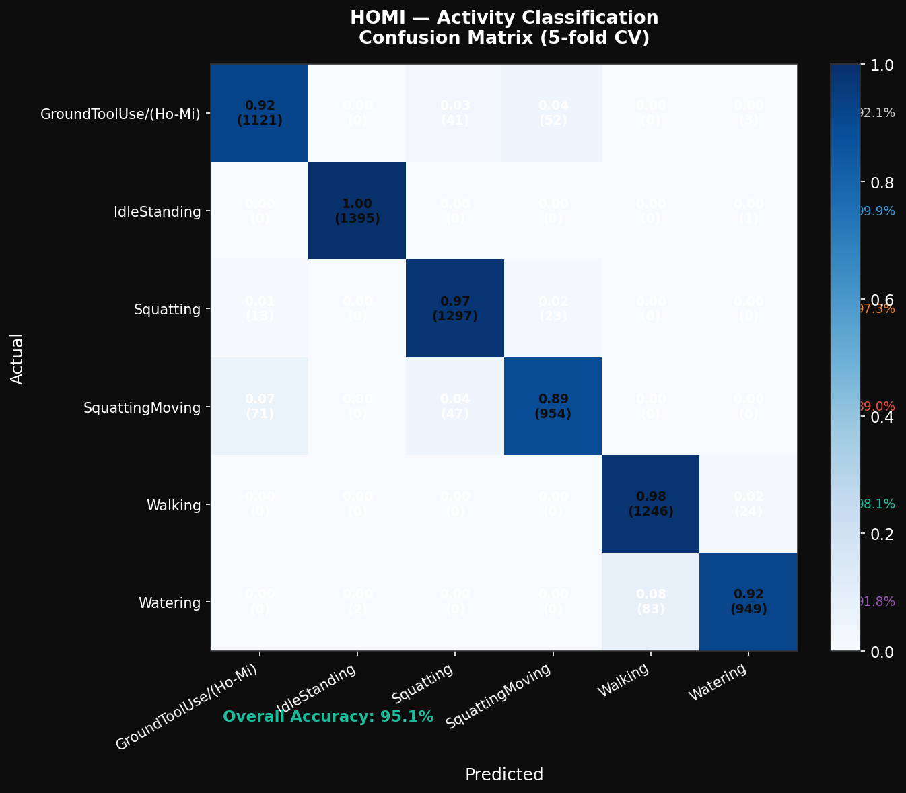
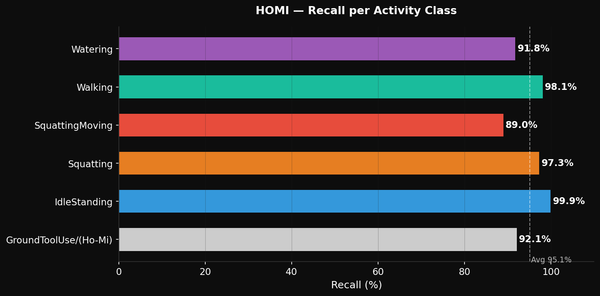
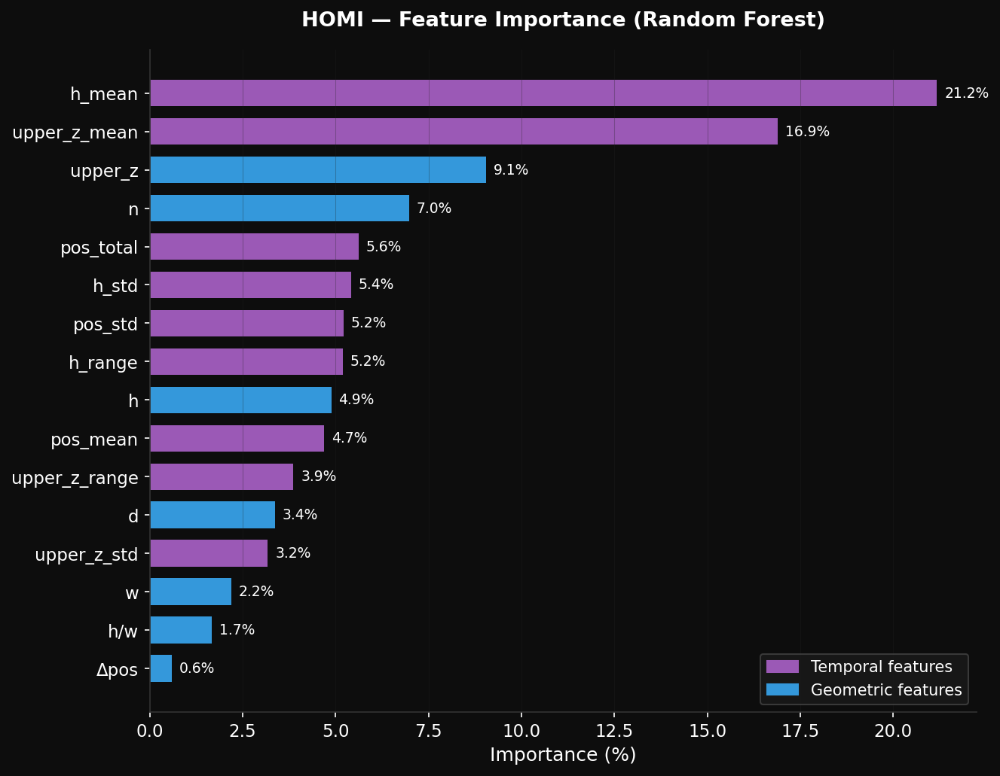
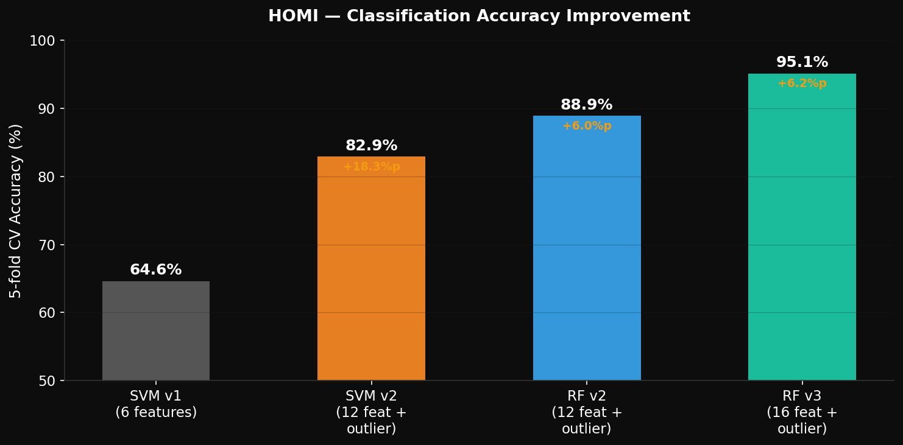
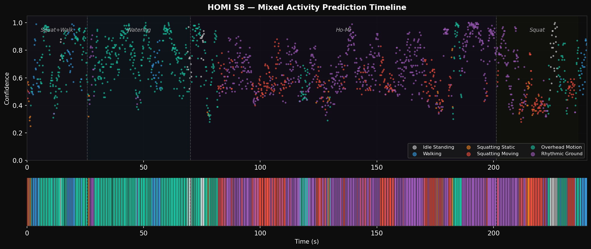
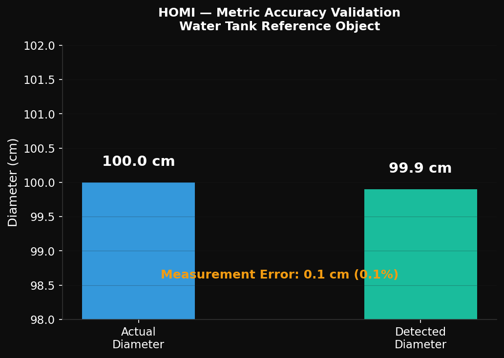

# HOMI — Results

All results are 5-fold cross-validation on 16,676 point-cloud frames, six activity classes, using a Random Forest classifier with 16 geometric and temporal features. **Overall accuracy: 95.1%.**

## Confusion matrix

The classifier separates the six activities cleanly. Idle standing is near-perfect. The main confusions are between the two squatting classes and between watering and walking, which share similar lower-body motion.

## Per-class recall

| Activity | Recall |
|---|---|
| IdleStanding | 99.9% |
| Walking | 98.1% |
| Squatting (static) | 97.3% |
| GroundToolUse / Ho-Mi | 92.1% |
| Watering | 91.8% |
| SquattingMoving | 89.0% |
| **Average** | **95.1%** |

The Ho-Mi hand-tool motion, a culturally specific rhythmic strike-and-pull at ground level that has never appeared in a sensing dataset before, is recognised at 92% recall.

## Feature importance

Height-based features dominate. `h_mean` (21.2%) and `upper_z_mean` (16.9%) together account for roughly 38% of the model's decisions, which matches intuition: posture height is the strongest signal for distinguishing standing, squatting, and ground-level work.

## Accuracy improvement across model versions

Performance rose from a 64.6% SVM baseline (6 features) to 95.1% with a Random Forest on 16 features with outlier handling. The largest single gain came from expanding the feature set and adding outlier handling.

| Model | Features | Accuracy |
|---|---|---|
| SVM v1 | 6 | 64.6% |
| SVM v2 | 12 + outlier | 82.9% |
| RF v2 | 12 + outlier | 88.9% |
| RF v3 | 16 + outlier | **95.1%** |

## Mixed-activity timeline (S8)

On the unscripted mixed sequence (S8), the model tracks activity transitions over time, showing it works beyond scripted single-activity clips.

## Metric accuracy validation

A 100.0 cm reference object was measured at 99.9 cm from the point cloud, a **0.1% error**, confirming the geometry is metrically reliable.
